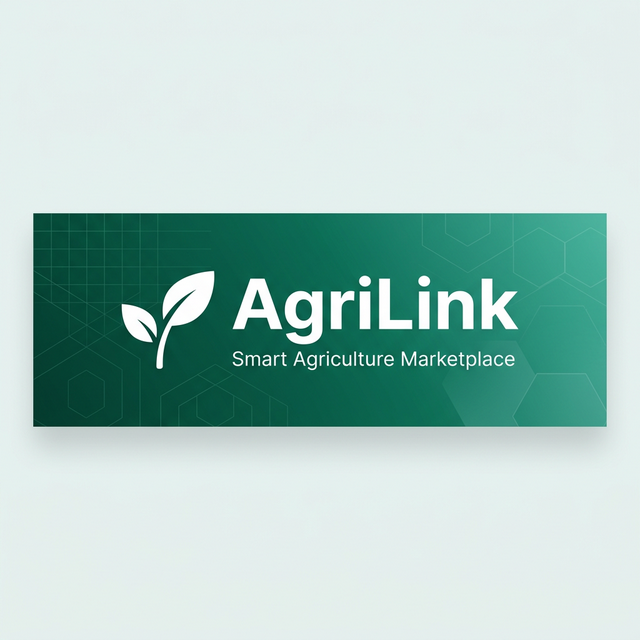

<p align="center">
  
</p>

<h1 align="center">🌾 AgriLink — Smart Agriculture Marketplace</h1>

<p align="center">
  <strong>Connecting Indian farmers with land, equipment, workers, and transport — all in one platform.</strong>
</p>

<p align="center">
  <a href="#features"></a>
  <a href="#tech-stack"></a>
  <a href="#tech-stack"></a>
  <a href="#tech-stack"></a>
  <a href="LICENSE"></a>
</p>

<p align="center">
  <a href="#-quick-start">Quick Start</a> •
  <a href="#-features">Features</a> •
  <a href="#-tech-stack">Tech Stack</a> •
  <a href="#-project-structure">Structure</a> •
  <a href="#-screenshots">Screenshots</a> •
  <a href="#-contributing">Contributing</a>
</p>

---

## 📖 About

**AgriLink** is a full-featured agriculture marketplace web application built to empower Indian farmers. It bridges the gap between farmers and essential agricultural resources — land for lease, modern equipment for rent, skilled labor, and logistics services — through a sleek, AI-powered platform.

The platform features **real-time weather insights**, **AI-driven farming advice**, **live market prices**, and **government scheme information** — all designed to help farmers make data-driven decisions and increase productivity.

---

## ✨ Features

| Module | Description |
|--------|-------------|
| 🏠 **Home** | Hero section with market prices, AI weather advisor, and featured services |
| 🗺️ **Land Marketplace** | Browse and lease verified agricultural land with soil type filters |
| 🚜 **Equipment Rental** | Rent modern machinery — tractors, drones, harvesters, and more |
| 👷 **Skilled Workers** | Hire tractor drivers, harvesters, sprayers, and irrigation specialists |
| 🚛 **Transport Services** | Book trucks and logistics for crop transportation |
| 📊 **Dashboard** | Analytics with booking trends, soil distribution charts, and weather data |
| 💬 **Real-time Messaging** | Chat with landowners, workers, and equipment providers |
| 👤 **Profile Management** | Manage listings, personal details, and account security |
| 📅 **Bookings** | Track and manage all rental requests with status updates |
| 🔐 **Authentication** | Email/password login, OTP verification, and password reset |
| 📆 **Crop Calendar** | Seasonal crop planning and activity tracker |
| 🛡️ **Admin Panel** | Platform administration and user management |

### 🔥 Highlights

- **🤖 AI Weather Advisor** — Real-time weather data with AI-generated farming advice based on your GPS location
- **📈 Live Market Prices** — Current mandi prices for major crops across Indian states
- **🌐 Multi-language Support** — English and Telugu with extensible i18n architecture
- **🎙️ Voice Assistant** — Hands-free navigation and queries for farmers in the field
- **🎨 Premium Design System** — Glassmorphism, micro-animations, and 10+ custom keyframe animations
- **📱 Fully Responsive** — Optimized for mobile, tablet, and desktop

---

## 🛠️ Tech Stack

### Frontend
| Technology | Purpose |
|-----------|---------|
| **React 19** | Component-based UI framework |
| **Vite 7** | Lightning-fast build tool and dev server |
| **Tailwind CSS 4** | Utility-first CSS framework |
| **Framer Motion** | Declarative animations and page transitions |
| **Recharts** | Data visualization (bar charts, pie charts) |
| **Lucide React** | Beautiful, consistent icon library |
| **React Router DOM 7** | Client-side routing and navigation |
| **Radix UI** | Accessible, unstyled UI primitives |

### Design System
| Feature | Implementation |
|---------|---------------|
| **Glassmorphism** | Backdrop blur + translucent backgrounds |
| **Premium Shadows** | Multi-layered box shadows with color tinting |
| **Animations** | 10+ custom keyframes (float, shimmer, pulse, etc.) |
| **Page Transitions** | Fade-up entrance animations on route change |
| **Micro-interactions** | Hover effects, active states, springy transforms |

### Backend
| Technology | Purpose |
|-----------|---------|
| **Base44** | Backend-as-a-service for auth, database, and file uploads |

---

## 📁 Project Structure

```
agri-link/
├── public/                  # Static assets
├── docs/                    # Documentation & images
│   └── banner.png           # Repository banner
├── src/
│   ├── api/                 # API client configuration
│   │   └── base44Client.js  # Base44 BaaS integration
│   ├── components/
│   │   ├── ui/              # Reusable UI components (Button, Card, etc.)
│   │   └── VoiceAssistant.jsx
│   ├── i18n/                # Internationalization
│   │   └── LanguageContext.jsx
│   ├── lib/                 # Utility functions
│   │   └── utils.js
│   ├── pages/
│   │   ├── Home.jsx         # Landing page with hero & market data
│   │   ├── Lands.jsx        # Land marketplace
│   │   ├── Equipment.jsx    # Equipment rental hub
│   │   ├── Workers.jsx      # Worker directory
│   │   ├── Transport.jsx    # Transport services
│   │   ├── Dashboard.jsx    # Analytics dashboard
│   │   ├── Messages.jsx     # Real-time messaging
│   │   ├── Profile.jsx      # User profile & listings
│   │   ├── Bookings.jsx     # Booking management
│   │   ├── Login.jsx        # Authentication
│   │   ├── CropCalendar.jsx # Crop planning calendar
│   │   └── Admin.jsx        # Admin panel
│   ├── App.jsx              # Root component with routing
│   ├── index.css            # Global design system & animations
│   └── main.jsx             # Application entry point
├── package.json
├── vite.config.js
└── README.md
```

---

## 🚀 Quick Start

### Prerequisites

- **Node.js** ≥ 18.x
- **npm** ≥ 9.x

### Installation

```bash
# Clone the repository
git clone https://github.com/adimalamanda/AgriShare.git
cd AgriShare

# Install dependencies
npm install

# Start the development server
npm run dev
```

The app will be available at `http://localhost:5173`

### Build for Production

```bash
# Create optimized production build
npm run build

# Preview the production build locally
npm run preview
```

---

## 🎨 Design System

AgriLink uses a custom-built design system defined in `index.css` with the following key elements:

### Color Palette
| Token | Value | Usage |
|-------|-------|-------|
| `--primary` | `#059669` | Buttons, links, accents |
| `--primary-dark` | `#047857` | Hover states, gradients |
| `--primary-darkest` | `#064e3b` | Deep accents, nav |

### Animation Library
- `float` / `float-slow` — Gentle floating effect for decorative elements
- `shimmer` — Loading skeleton animation
- `fadeUp` — Page entrance transitions
- `textShimmer` — Gradient text animation on hero headings
- `glowBorder` — Rotating gradient border effect
- `ripple` — Expanding circle for notifications
- `subtleBounce` — Gentle bounce for CTAs

### Utility Classes
```css
.glass          /* Glassmorphism with backdrop blur */
.glass-card     /* Card variant with enhanced glass */
.card-hover     /* Springy hover lift effect */
.btn-premium    /* Gradient button with shimmer overlay */
.heading-decoration  /* Animated gradient underline */
.avatar-glow    /* Pulsing glow ring on hover */
.input-modern   /* Enhanced input with focus glow */
.premium-shadow /* Multi-layered card shadow */
```

---

## 🌐 API Integration

AgriLink integrates with the following APIs:

| API | Purpose | Auth Required |
|-----|---------|---------------|
| **Open-Meteo** | Real-time weather forecasts | No |
| **Nominatim (OSM)** | Reverse geocoding for location names | No |
| **Base44** | User auth, CRUD operations, file uploads | Yes |

---

## 🤝 Contributing

Contributions are welcome! Here's how to get started:

1. **Fork** the repository
2. **Create** a feature branch: `git checkout -b feature/amazing-feature`
3. **Commit** your changes: `git commit -m 'Add amazing feature'`
4. **Push** to the branch: `git push origin feature/amazing-feature`
5. **Open** a Pull Request

### Development Guidelines

- Follow the existing design system in `index.css`
- Use `framer-motion` for all animations
- Keep components in the `src/pages/` or `src/components/` directories
- Use `lucide-react` for icons
- Ensure responsive design across mobile, tablet, and desktop

---

## 📄 License

This project is licensed under the **MIT License**. See the [LICENSE](LICENSE) file for details.

---

## 👨‍💻 Author

**Adi Malamanda**

- GitHub: [@adimalamanda](https://github.com/adimalamanda)

---

<p align="center">
  <strong>Built with ❤️ for the future of Indian agriculture</strong>
</p>

<p align="center">
  
</p>
